# Codantic AI - Educational AI Agent Loop

> **For Educational Purposes Only** - A demonstration of AI agent architecture with file system tools

A Python-based AI agent system that provides an interactive command-line interface for AI-powered file operations and code assistance. Built using **Pydantic AI's Direct API** for minimal abstraction and maximum educational clarity, powered by Google's Gemini API.

## 🧠 **Why Pydantic AI Direct API?**

This project uses `pydantic_ai.direct.model_request_sync()` - a **minimal abstraction approach** that's perfect for learning:

- **🔍 Transparency**: See exactly how LLM interactions work under the hood  
- **📚 Educational**: No magic frameworks hiding the core concepts
- **🛠 Control**: Direct access to conversation context and tool calling
- **🎯 Clarity**: Every API call is explicit and traceable

## 🎯 Features

- **Interactive AI Agent Loop**: Conversational interface with persistent context management
- **9 Built-in Tools**: Comprehensive file system operations (read, write, edit, search, etc.)
- **Smart Context Management**: Automatic token limit handling with context trimming
- **Rich Terminal UI**: Beautiful command-line interface with colored panels and formatting
- **Security-First Design**: Sandboxed operations within working directory boundaries
- **Audit Trail**: Enterprise-ready logging for all file modifications

## 🛠 Available Tools

| Tool | Description |
|------|-------------|
| `read` | Read files with optional line skipping and limiting |
| `write` | Create new files with audit logging |
| `edit` | Perform exact string replacements in files |
| `multiedit` | Apply multiple edits to a file atomically |
| `ls` | List directory contents recursively |
| `glob` | Pattern-based file searching |
| `grep` | Regex pattern searching in file contents |
| `bash` | Execute shell commands safely |
| `todo` | Task management for complex operations |

## 🎬 **Live Demo**

[](https://asciinema.org/a/codantic-ai)

> Watch the agent in action! See how it handles file operations, tool calling, and interactive conversations using Pydantic AI's direct API.

## 🚀 Quick Start

### Prerequisites

- Python 3.13+
- Google Gemini API key ([Get one here](https://ai.google.dev/))

### Installation

1. **Clone the repository**
   ```bash
   git clone <your-repo-url>
   cd codantic-ai
   ```

2. **Set up environment**
   ```bash
   # Create virtual environment
   python -m venv .venv
   source .venv/bin/activate  # On Windows: .venv\Scripts\activate
   
   # Install dependencies
   pip install -r requirements.txt
   # OR if using uv:
   uv sync
   ```

3. **Configure API key**
   ```bash
   cp .env.example .env
   # Edit .env and add your Gemini API key
   ```

4. **Run the agent**
   ```bash
   python main.py
   ```
   
   The agent will automatically create a `code/` directory where it performs all operations, keeping your source code safe.

## 💡 Usage Examples

### Basic Interaction
```
👤 You: Create a Python script that prints hello world
🤖 AI: [Creates hello.py file using write tool]

👤 You: Read the file and modify it to print "Hello, AI!"
🤖 AI: [Uses read tool, then edit tool to modify the content]

👤 You: List all Python files in the current directory
🤖 AI: [Uses glob tool with *.py pattern]
```

### Multi-step Tasks
```
👤 You: Refactor this codebase by adding docstrings to all functions
🤖 AI: [Uses todo tool to break down task, then systematically processes each file]
```

## ⚙️ Configuration

### Environment Variables
- `GEMINI_API_KEY`: Your Google Gemini API key (required)

### Agent Parameters
- `model_name`: AI model to use (default: 'google-gla:gemini-2.5-flash')
- `working_directory`: Sandbox directory for operations (default: '.')
- `max_context_tokens`: Token limit before context trimming (default: 100,000)
- `max_iterations`: Maximum agent loop iterations (default: 20)

## 🔒 Security Features

- **Isolated Working Directory**: Agent operates in `code/` directory, protecting source code
- **Sandboxed Operations**: All file operations restricted to working directory
- **Path Validation**: Prevents directory traversal attacks
- **Audit Logging**: Required for all write operations
- **Error Handling**: Comprehensive exception management
- **Token Limits**: Prevents runaway context growth

## 🏗 Architecture

```mermaid
graph TB
    A[👤 User Input] --> B[🔄 AgentLoop.run]
    B --> C[📝 Add to Context]
    C --> D[🤖 Pydantic AI Direct API<br/>model_request_sync]
    D --> E{🛠 Tool Calls?}
    
    E -->|Yes| F[⚡ Execute Tools]
    F --> G[📋 Add Tool Results to Context]
    G --> D
    
    E -->|No| H[💬 Final Response]
    H --> I[🎨 Rich Display]
    
    subgraph "🧰 Tool System"
        J[📖 read] 
        K[✏️ write]
        L[🔍 grep]
        M[📁 glob]
        N[🔧 bash]
        O[📝 edit]
        P[📋 todo]
        Q[📂 ls]
        R[✨ multiedit]
    end
    
    F --> J & K & L & M & N & O & P & Q & R
```



### 🔄 **Agent Loop Flow**


### Core Components

- **`AgentLoop`**: Main orchestration class managing conversation flow
- **`Tool System`**: Modular file system operations with security boundaries
- **`Rich UI`**: Terminal interface with panels and formatting
- **`Context Management`**: Smart token limiting and history trimming

## 🎓 Educational Value

This project demonstrates:

- **🤖 AI Agent Architecture**: How to build conversational AI systems from scratch
- **🔧 Pydantic AI Direct API**: Minimal abstraction for maximum learning clarity
- **🛠 Tool Integration**: Extending AI capabilities with external functions
- **🧠 Context Management**: Handling long conversations within token limits
- **🔒 Security Patterns**: Sandboxing and input validation
- **🐍 Python Best Practices**: Type hints, error handling, modular design
- **💻 CLI Development**: Rich terminal interfaces and user experience

### 🔍 **Key Learning Points**

```python
# Direct API usage - no hidden abstractions!
model_response = model_request_sync(
    self.model_name,
    self.context,  # Full conversation history
    model_request_parameters=ModelRequestParameters(
        function_tools=tools_definitions,  # Your custom tools
        allow_text_output=True,
    ),
)
```

Students can see exactly how:
- 📝 **Context is managed** (`self.context` list)
- 🛠 **Tools are integrated** (`function_tools` parameter)  
- 🔄 **Agent loops work** (iteration with tool calling)
- 💾 **Memory is handled** (context trimming logic)

## 📚 Learning Opportunities

### For Students
- 🔍 **Study the agent loop pattern** in `agent_loop.py:221-315`
- 🛠 **Examine tool design patterns** in `tools/` directory  
- 🔗 **Learn Pydantic AI Direct API** integration (`model_request_sync`)
- 🔒 **Understand security considerations** in AI applications
- 📊 **Explore context management** and token limiting strategies

### For Educators  
- 🎓 **Use as foundation** for AI/ML coursework
- 💡 **Demonstrate practical AI** application development
- 🔐 **Teach security principles** and software engineering
- 🐍 **Show modern Python practices** with type hints and error handling
- 📈 **Compare with high-level frameworks** to show the difference

## 🤝 Contributing

This is an educational project. Feel free to:

- Fork and experiment with different AI models
- Add new tools and capabilities
- Improve the user interface
- Enhance security features
- Add comprehensive tests

## ⚠️ Limitations & Disclaimers

- **Educational Purpose Only**: Not intended for production use
- **API Costs**: Gemini API usage may incur charges
- **File Operations**: Can modify files within working directory
- **No Warranty**: Use at your own risk

## 📄 License

See [LICENSE](LICENSE) file for details.

## 🙏 Acknowledgments

- Built with [Pydantic AI](https://ai.pydantic.dev/)
- Powered by [Google Gemini](https://ai.google.dev/)
- UI by [Rich](https://rich.readthedocs.io/)

---

**Happy Learning! 🎓✨**