# Codantic AI - Educational AI Agent Loop

> **For Educational Purposes Only** - Learn AI agent architecture with minimal abstractions

A Python AI agent system using **Pydantic AI's Direct API** for maximum learning clarity. Built with Google Gemini and featuring 9 file system tools.

## 🧠 **Why This Approach?**

Uses `pydantic_ai.direct.model_request_sync()` - minimal abstraction perfect for learning:
- **🔍 See exactly** how LLM interactions work
- **📚 No magic** - every API call is explicit  
- **🛠 Direct control** over context and tool calling

## 🎬 **Live Demo**

[](https://asciinema.org/a/eH0Mktbv8TTNlEyUFJ8nYpV74)

## 🛠 **9 Built-in Tools**

| Tool | Description |
|------|-------------|
| `read` | Read files with optional line limits |
| `write` | Create files with audit logging |
| `edit` | String replacements in files |
| `multiedit` | Multiple edits atomically |
| `ls` | List directory contents |
| `glob` | Pattern-based file search |
| `grep` | Regex search in file contents |
| `bash` | Execute shell commands |
| `todo` | Task management |

## 🚀 **Quick Start**

### Prerequisites
- Python 3.13+
- Google Gemini API key ([Get one here](https://ai.google.dev/))

### Installation
```bash
git clone <your-repo-url>
cd codantic-ai

# Setup environment
python -m venv .venv
source .venv/bin/activate  # Windows: .venv\Scripts\activate

# Install dependencies  
pip install -r requirements.txt
# OR: uv sync

# Configure API key
cp .env.example .env
# Edit .env and add your Gemini API key

# Run the agent
python main.py
```

## 🏗 **How It Works**

```mermaid
graph TB
    A[👤 User Input] --> B[🔄 AgentLoop]
    B --> C[🤖 Pydantic AI Direct API]
    C --> D{🛠 Tool Calls?}
    D -->|Yes| E[⚡ Execute Tools]
    E --> B
    D -->|No| F[💬 Response]
```



### Key Learning Points
```python
# Direct API usage - no hidden abstractions!
model_response = model_request_sync(
    self.model_name,
    self.context,  # Full conversation history
    model_request_parameters=ModelRequestParameters(
        function_tools=tools_definitions,  # Your custom tools
        allow_text_output=True,
    ),
)
```

Students see exactly how:
- 📝 Context is managed (`self.context` list)
- 🛠 Tools are integrated (`function_tools`)
- 🔄 Agent loops work (iteration with tool calling)

## 🎓 **Educational Value**

Perfect for learning:
- **🤖 AI Agent Architecture** from scratch
- **🔧 Minimal Abstractions** vs frameworks
- **🛠 Tool Integration** patterns
- **🧠 Context Management** strategies
- **🔒 Security Patterns** and sandboxing

## 🔒 **Security Features**

- **Isolated Working Directory** (`code/` folder)
- **Path Validation** (prevents traversal)
- **Audit Logging** for all operations
- **Token Limits** (prevents runaway costs)

## ⚠️ **Important Notes**

- **Educational Purpose Only** - Not for production
- **API Costs** - Gemini usage may incur charges
- **File Operations** - Can modify files in working directory

## 📄 **License**

MIT License - See [LICENSE](LICENSE) file.

## 🙏 **Built With**

- [Pydantic AI](https://ai.pydantic.dev/) - Direct API approach
- [Google Gemini](https://ai.google.dev/) - LLM provider
- [Rich](https://rich.readthedocs.io/) - Terminal UI

---

**Happy Learning! 🎓✨**