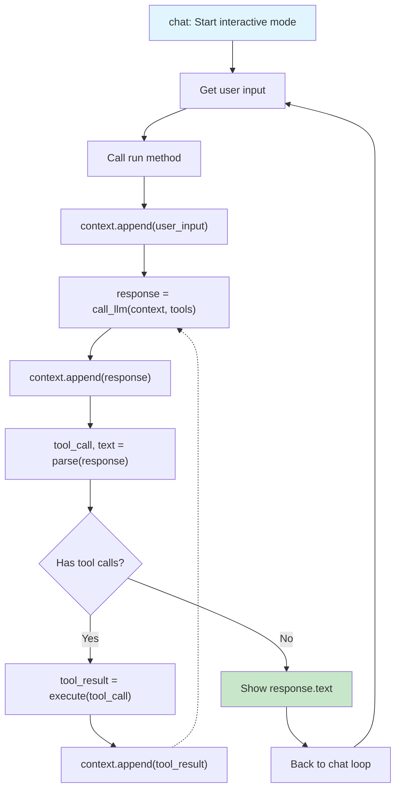

# Agent Loop Workflow - Chat & Run Methods

## Core Flow

- **chat()**: Interactive loop that gets user input and calls run()
- **run()**: Processes user input through model iterations with tool calling support
- **Tool Loop**: Continues iterating until no more tool calls or max iterations reached